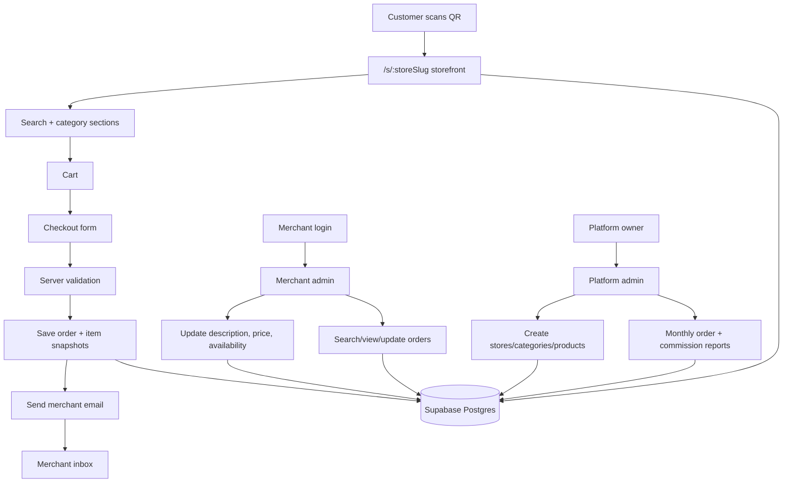

# Merchant Ordering Platform - Wave Plan

## 0. Product Direction

This system is a reusable local merchant ordering platform.

The first store is **Eyal Chekku Oils**. The current Eyal design in this directory is the first storefront theme and visual baseline. Future merchants should reuse the same system with different store data, categories, products, prices, logo, and theme settings.

The customer flow is intentionally lightweight:

1. Customer scans QR code in the shop or receives a store link.
2. Customer opens the mobile-first storefront.
3. Customer searches or browses product categories.
4. Customer adds products to cart.
5. Customer enters name, Indian phone number, address/area, and optional note.
6. System stores the order and emails the merchant.
7. Merchant contacts customer directly for confirmation and payment.

No online payment in V1. No customer accounts in V1. No OTP in V1, but the checkout code must be structured so OTP can be inserted later before order creation.

## 1. Core Rules

### Storefront

- One reusable storefront page powers all stores.
- Store data is selected by slug first: `/s/eyal-chekku-oils`.
- Custom domains come later after the first few stores are proven.
- Eyal uses the existing local design language:
  - parchment background
  - brass and dark green accents
  - premium serif headings
  - mobile-first product cards
  - cart drawer pattern

### Merchant Controls

Merchants should not edit images in V1. Product images are platform-managed.

Merchants can edit only operational fields:

- product description
- product price
- product availability
- order status

Use one merchant-facing availability control, not two confusing controls.

Recommended internal model:

- `availability_status = available | unavailable`
- `is_archived` or `deleted_at` remains platform-owner-only for removing products from long-term catalog/admin views.

Reason: for merchants, "out of stock" and "inactive" mean the same practical thing: customers should not order it. Do not expose two toggles.

### Phone Number Rules

This is India-only.

Customer checkout phone input:

- UI locks country code to `+91`.
- User enters exactly 10 digits.
- Store normalized phone as `+91XXXXXXXXXX`.
- Reject non-Indian numbers in V1.

Merchant/admin search:

- Merchant can search by customer name.
- Merchant can search by 10-digit phone number without typing `+91`.
- Search should normalize both `9840445725` and `+919840445725` to the same match path.

### Orders

Orders are tracked even after email is sent because monthly commission depends on order history.

Merchant can:

- view past orders
- search past orders by customer name or phone
- open order details
- change order status

V1 order statuses:

- `new`
- `contacted`
- `completed`
- `cancelled`

Commission should count only `completed` orders by default.

## 2. Target Architecture

## 3. Data Model Direction

Tables:

- `stores`
- `categories`
- `products`
- `product_variants`
- `orders`
- `order_items`
- `merchant_users`
- `commission_rules`
- `commission_entries`

Important behavior:

- `orders` stores customer data, order status, total, email status, and timestamps.
- `order_items` stores snapshots of product name, unit, price, quantity, and line total.
- Do not calculate old orders from live product prices.
- Product images are platform-managed through storage and owner/admin tooling, not merchant V1 UI.

## 4. Future Merchant Integration Flow

New merchant setup should become mostly data entry:

1. Create store record.
2. Add logo and theme settings.
3. Add categories.
4. Add products.
5. Add variants/prices.
6. Add merchant order email.
7. Create merchant admin login.
8. Generate QR code for `/s/:storeSlug`.
9. Test one order.
10. Go live.

For future stores, the storefront shell does not change. Only data changes.

## 5. Wave 1 - Next.js Foundation And Existing Eyal Theme

Status: **Done** in commit `7bf6e11`.

Goal: move from static HTML/CSS/JS toward a structured app without changing the product behavior yet.

Build:

- Create a Next.js app structure in this project.
- Preserve the existing Eyal visual style and responsive behavior.
- Convert the current static sections into components:
  - layout/header
  - hero
  - trust/process
  - product grid
  - cart drawer
  - footer
- Keep product data local/static for this wave.
- Keep checkout as non-functional or preview-only.

Acceptance:

- App runs locally.
- Eyal storefront visually matches or improves the current static page.
- Mobile layout works cleanly.
- Cart add/remove/quantity behavior still works.
- No database dependency yet.

Commit gate:

- Build passes.
- Mobile and desktop screenshots checked.
- No product/order DB work in this wave.

Notes:

- The old static files were kept as legacy reference.
- The first usable route is `/s/eyal-chekku-oils`.
- Checkout intentionally remains preview-only.

## 6. Wave 2 - Store/Product Data Model In Code

Status: **Done** in commit `90520c3`.

Goal: make the app data-driven before adding Supabase.

Build:

- Replace hardcoded `PRODUCTS` with typed local store data.
- Model one store object for Eyal:
  - store name
  - slug
  - logo
  - contact numbers
  - theme values
  - categories
  - products
  - variants
- Add categories:
  - Oils
  - Rice & Poha
  - Nuts & Seeds
  - Others
- Add mobile-first product search.
- Add category sections:
  - collapsed by default on mobile
  - expanded by default on desktop

Acceptance:

- `/s/eyal-chekku-oils` renders from local typed data.
- Search works by product name and category.
- Category collapse/expand works.
- Cart still works with variants.

Commit gate:

- Local data can be swapped to another fake store without changing component logic.
- No Supabase dependency yet.

Notes:

- The component-facing store shape became reusable: store metadata, categories, products, and variants.
- Eyal has 10 products in local fallback data.
- Missing product-specific images are still placeholders for some products until platform-managed assets are added.

## 7. Wave 3 - Supabase Schema And Seed Data

Status: **Done** in commit `522c39b`.

Goal: introduce the single database for multiple stores.

Build:

- Add Supabase project configuration.
- Create migrations for:
  - stores
  - categories
  - products
  - product_variants
  - orders
  - order_items
  - merchant_users
  - commission_rules
  - commission_entries
- Seed Eyal store data.
- Store product images/logos in a controlled asset path or Supabase Storage.
- Keep merchant image editing out of scope.

Acceptance:

- Database schema applies cleanly.
- Seed script creates Eyal store, categories, products, and variants.
- Public storefront can still run using local fallback if DB is not wired yet.

Commit gate:

- Migration can be reset and reapplied.
- Seed is idempotent or clearly documented.

Notes:

- Supabase schema and Eyal seed were created under `supabase/`.
- Remote seed was verified with 1 store, 4 categories, 10 products, and 18 variants.
- `@supabase/server` was added with health and JWT-protected smoke-test route handlers.
- `.env.local` is intentionally ignored. Never commit Supabase secret keys.
- Merchant image editing remains out of scope. Product image paths are platform-managed.
- Public RLS read policies exist for active stores and visible catalog rows.

## 8. Wave 4 - DB-Backed Public Storefront

Status: **Done** in commit `ef5e1b0`.

Goal: public storefront reads live store/product data from Supabase.

Build:

- Load store by slug.
- Load categories and products for that store.
- Load active product variants.
- Use `availability_status` to disable unavailable products.
- Keep current Eyal theme from store/theme data.

Acceptance:

- `/s/eyal-chekku-oils` reads from Supabase.
- Products display in correct categories/order.
- Unavailable products are visible but cannot be added, or hidden if explicitly configured.
- Search and category collapse still work.

Commit gate:

- No hardcoded Eyal products remain in UI logic.
- Store slug not found returns a clean not-found state.

Notes:

- `/s/:storeSlug` now loads active store, category, product, and variant data from Supabase.
- The route is dynamic so merchant/catalog updates can be reflected without a rebuild.
- Local Eyal fallback is allowed only in development. Production should fail closed with not-found/error behavior instead of silently serving stale hardcoded catalog data.
- Product and variant `availability_status` is mapped into the UI; unavailable items cannot be added to cart.

## 9. Wave 5 - Checkout And Order Creation

Status: **Done** in commit `efaeeb2`.

Goal: customer can place an order that is stored correctly.

Build:

- Add checkout form:
  - name
  - Indian phone number with locked `+91`
  - exactly 10 digit input
  - address/area
  - optional note
- Normalize phone to `+91XXXXXXXXXX`.
- Server-side validation for:
  - store exists and active
  - customer name
  - phone format
  - address
  - cart not empty
  - product variants valid and available
- Save order and order item snapshots.
- Add future OTP hook:
  - store setting `requires_phone_verification`
  - disabled for V1
  - checkout code has a clear place to require `phone_verified = true` later

Acceptance:

- Valid order is stored in DB.
- Invalid phone numbers are rejected.
- Inactive/unavailable products cannot be ordered.
- Old order item price remains unchanged after product price changes.

Commit gate:

- Order creation tests pass.
- Manual mobile checkout test passes.

Implementation notes:

- Checkout must submit variant IDs and quantities only.
- Server must rebuild product names, prices, totals, and item snapshots from Supabase.
- Customer phone is stored only as normalized `+91XXXXXXXXXX`.
- The OTP hook lives in checkout validation through `stores.settings.requires_phone_verification`; it remains disabled for V1.
- Short-term note: order and item writes are handled server-side with cleanup on item insert failure. Before meaningful traffic, move this into a Postgres RPC so order creation is fully atomic.
- Verified with an API integration test for invalid phone rejection, valid order creation, and immutable item price snapshots after a live variant price change.
- Verified the mobile checkout drawer at 390px width; the app now declares an explicit mobile viewport and the drawer uses full mobile width.

## 10. Wave 6 - Email Order Delivery

Status: **Implemented** in commit `897a46d`; pending live Resend credential verification.

Goal: merchant receives order emails.

Build:

- Add email provider integration.
- Send merchant email after DB order save.
- Email includes:
  - store name
  - order id
  - customer name
  - normalized phone
  - address/area
  - cart lines
  - total
  - note
- Track `email_status`:
  - `pending`
  - `sent`
  - `failed`

Acceptance:

- Test order sends email.
- If email fails, order remains saved.
- Failed email status is visible to platform owner/admin later.

Commit gate:

- No email API secrets in frontend.
- Email failure does not lose orders.

Implementation notes:

- Order email delivery uses Resend from server-only code.
- Required runtime env:
  - `RESEND_API_KEY`
  - `ORDER_EMAIL_FROM`
  - `ORDER_EMAIL_TO` unless `stores.merchant_order_email` is populated
- Order creation now saves the order with `email_status = pending`, attempts merchant email delivery, then updates to `sent` or `failed`.
- Email failure does not roll back or delete the order.
- `email_error` records the failure message for later platform/admin visibility.
- Verified the no-secret/front-end gate by checking env usage is limited to `.env.example`, `lib/email`, and the server order route.
- Verified failure mode with missing Resend config: API still returned order success and DB stored `email_status = failed`.
- Live send verification is blocked until real Resend env values and a recipient are configured.

## 11. Wave 7 - Merchant Admin Auth And Product Operations

Status: **Implemented** in commit `ac13bc9`; pending manual Supabase Auth merchant-user verification.

Goal: merchant can update operational product fields.

Build:

- Supabase Auth login for merchants.
- Merchant route protection.
- Merchant can only access assigned store.
- Product admin page supports:
  - description edit
  - price edit
  - availability toggle: available/unavailable
- Merchant cannot edit product images.
- Merchant cannot delete products in V1.

Acceptance:

- Merchant login works.
- Merchant cannot access another store.
- Price update reflects on storefront.
- Availability update reflects on storefront.

Commit gate:

- Authorization tests or manual RLS verification completed.
- No exposed admin mutation route without auth.

Implementation notes:

- Added `/admin` merchant portal.
- Added Supabase Auth password login from the browser using the publishable key only.
- Added protected server APIs:
  - `/api/admin/me`
  - `/api/admin/products`
- Product admin supports:
  - description edits
  - product availability updates
  - variant price updates
  - variant availability updates
- Product image editing and deletion are intentionally not exposed.
- Server route handlers re-check merchant/store access before using the admin Supabase client.
- Unauthenticated admin API access was smoke-tested and returns `401`.

Manual verification needed:

- Create a Supabase Auth user for the Eyal merchant.
- Insert a matching `merchant_users` row for `eyal-chekku-oils`.
- Login at `/admin`.
- Change one product description and verify `/s/eyal-chekku-oils` reflects it.
- Change one price and verify storefront reflects it.
- Mark one variant unavailable and verify checkout rejects it, then restore it.

## 12. Wave 8 - Merchant Order History And Search

Status: **Implemented** in commit `ac13bc9`; pending manual merchant-user verification with real orders.

Goal: merchant can use the system operationally after orders arrive.

Build:

- Merchant order list.
- Filters:
  - status
  - date range
  - customer name
  - phone search
- Phone search accepts:
  - 10 digit number
  - `+91` number
  - spaces ignored
- Order detail page.
- Status update:
  - new
  - contacted
  - completed
  - cancelled

Acceptance:

- Merchant can find orders by customer name.
- Merchant can find orders by 10 digit phone without typing `+91`.
- Status changes persist.
- Completed orders are clearly distinguishable.

Commit gate:

- Order list works on mobile.
- Search does not expose other stores' orders.

Implementation notes:

- Added protected `/api/admin/orders`.
- Merchant order list supports:
  - status filter
  - customer name search
  - 10 digit phone search with automatic `+91` normalization
  - `+91` phone search with spaces ignored
  - order item detail display
  - status updates to `new`, `contacted`, `completed`, and `cancelled`
- Status timestamp fields are updated for contacted/completed/cancelled transitions.
- Store access is checked server-side before orders are read or changed.

Manual verification needed:

- Login as Eyal merchant.
- Place a real test order.
- Search by customer name.
- Search by 10 digit phone without typing `+91`.
- Change status to contacted, completed, and cancelled.
- Confirm merchant cannot see another store after a second store exists.

## 13. Wave 9 - Platform Owner Admin And Commission

Status: **Implemented** in commit `ac13bc9`; pending owner env and manual report verification.

Goal: platform owner can track business value and commission.

Build:

- Owner-only admin section.
- Store list.
- Order summary by store.
- Monthly report:
  - submitted orders
  - completed orders
  - cancelled orders
  - total completed order value
  - commission due
- Commission default: per completed order.
- Commission settings per store:
  - fixed amount per completed order
  - optional percentage later

Acceptance:

- Owner can view Eyal monthly report.
- Completed orders count toward commission.
- New/contacted/cancelled orders do not count toward commission.

Commit gate:

- Report totals match direct DB query.
- Owner routes not accessible to merchants.

Implementation notes:

- Added owner-only `/api/owner/report`.
- `/admin` shows Owner tab only when the authenticated email is listed in `PLATFORM_OWNER_EMAILS`.
- Monthly report includes:
  - submitted orders
  - completed orders
  - cancelled orders
  - completed order value
  - commission due
- Commission calculation uses current active `commission_rules`.
- Owner route returns `403` for non-owner authenticated users.

Manual verification needed:

- Set `PLATFORM_OWNER_EMAILS` in local/Vercel env.
- Login as an owner email.
- Open Owner tab in `/admin`.
- Compare a monthly report against the SQL query in `docs/order-export-notes.md`.
- Verify a merchant email not listed in `PLATFORM_OWNER_EMAILS` cannot load `/api/owner/report`.

## 14. Wave 10 - QR And Merchant Onboarding Workflow

Status: **Partially implemented** in commit `ac13bc9`.

Goal: new stores can be created repeatably.

Build:

- Store creation checklist for platform owner.
- Generate QR code for store URL.
- New store setup can create:
  - store
  - merchant user
  - categories
  - products
  - variants
  - commission rule
- Add a documented onboarding template.

Acceptance:

- A second demo store can be added without code changes.
- QR opens the correct `/s/:storeSlug`.
- Merchant login only sees that store.

Commit gate:

- Second demo store proves system is reusable.
- No duplicated storefront code per merchant.

Implementation notes:

- Added public QR SVG endpoint:
  - `/api/stores/:storeSlug/qr`
- Added QR display in owner admin tab.
- Added onboarding template:
  - `docs/merchant-onboarding-template.md`
- QR endpoint was smoke-tested and returns SVG.
- The storefront remains data-driven by store slug; no code duplication is needed for another merchant storefront.

Manual verification needed:

- Deploy to Vercel and set `NEXT_PUBLIC_SITE_URL`.
- Open `/api/stores/eyal-chekku-oils/qr`.
- Scan QR from a phone and confirm it opens the deployed `/s/eyal-chekku-oils`.
- Add a second demo store in Supabase.
- Confirm second store works without code changes.
- Confirm second store merchant sees only that store.

## 15. Wave 11 - Production Hardening

Status: **Implemented for V1 baseline** in commit `ac13bc9`; pending deployment/security review.

Goal: make the system safe enough to run for real merchants.

Build:

- Rate limit checkout endpoint lightly.
- Add honeypot field to checkout form.
- Add structured server logs for order creation and email failures.
- Add basic error pages.
- Add backup/export notes for orders.
- Add monitoring checklist.

Acceptance:

- Repeated invalid checkout attempts are throttled.
- Email failure is logged and visible.
- Orders can be exported for manual recovery/reporting.

Commit gate:

- Security review complete for public checkout and merchant admin.
- No secrets in client bundle.

Implementation notes:

- Added lightweight in-memory checkout rate limiting.
- Added checkout honeypot field.
- Added structured server logs for:
  - validation failures
  - rate limiting
  - order creation
  - email failures
- Added app-level `not-found` and `error` pages.
- Added order export/recovery notes:
  - `docs/order-export-notes.md`
- `.env.example` documents all required runtime variables without secrets.
- Build and typecheck pass after hardening changes.

Manual verification needed:

- Confirm Vercel runtime has all required env values.
- Confirm no Supabase secret key appears in browser source or network payloads.
- Try repeated invalid checkout submissions and confirm throttling.
- Review Vercel logs after a test order and failed email case.
- Export orders using the SQL in `docs/order-export-notes.md`.

Deployment notes:

- GitHub remote: `https://github.com/hari-learns/EyalSystem.git`
- Pushed branch: `main`
- Vercel project: `eyal-system`
- Temporary production URL: `https://eyal-system.vercel.app`
- Verified deployed routes:
  - `/s/eyal-chekku-oils` returned `200`
  - `/admin` returned `200`
  - `/api/admin/me` returned `401` without a user token
  - `/api/stores/eyal-chekku-oils/qr` returned SVG
  - `/api/orders` accepted a smoke order and stored it; smoke order was deleted afterward
- Vercel log scan showed the expected `checkout_email_failed` entry because Resend env is not configured yet.

## 16. Later Waves - Not V1

Do not build these until Eyal and at least one more store are live:

- OTP checkout gate using DLT templates.
- Custom domains per merchant.
- WhatsApp order delivery.
- Payment collection.
- Merchant image upload.
- Full theme/builder editor.
- Inventory quantity tracking.
- Delivery partner integration.

These are valid future features, but building them before V1 will slow the system down and increase bug surface.
